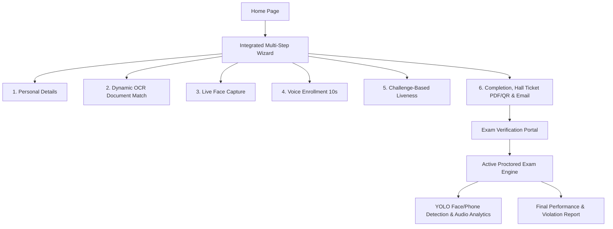

# OmniVerifyX AI

OmniVerifyX AI is a state-of-the-art, fully integrated, AI-powered identity verification and proctored examination platform. The system combines robust OCR document analysis, multi-modal biometrics (Face and Voice), real-time challenge-based liveness verification, and an online exam engine with active YOLO-based proctoring to deliver a highly secure candidate testing experience.

## System Architecture



## Features

- **Integrated Multi-Step Wizard**: Seamless registration wizard capturing details and performing dynamic document, photo, and voice verification.
- **Dynamic OCR Eligibility Verification**: Validates Aadhaar (Always), Caste Certificate (SC/ST/BC), and Income Certificate (based on income threshold) using EasyOCR, parsing Aadhaar numbers, candidate names, and date of birth.
- **Biometric Enrollment & Verification**: Employs face matching and microsoft/wavlm-base-plus-sv voice matching with segment-based similarity averaging, duration verification, and silence detection.
- **Challenge-Based Liveness Detection**: Real-time evaluation checks for a single face, head turns (left/right/center), and eye blinks using MediaPipe Face Mesh.
- **AI-Powered Proctoring**: Live YOLO-based detection tracking mobile phones, face presence, and multiple faces during exam sessions.
- **Automated Hall Ticket Generation**: Creates secure, downloadable PDFs with embedded QR code authentication, and transmits them via SMTP.
- **Live Monitoring Dashboard**: Real-time admin views of candidate progress, live violation count, and color-coded risk indicators refreshed automatically.
- **Reporting & Analytics**: Comprehensive reports detailing violation history, biometric thresholds, and score metrics.

## Installation & Setup

### Prerequisites

- **Python 3.8+**
- **Node.js 16+**
- **Git**

### Backend Setup

1. Navigate to the backend directory:
   ```bash
   cd backend
   ```
2. Create and activate a virtual environment:
   ```bash
   python -m venv .venv
   # Windows
   .venv\Scripts\activate
   # macOS/Linux
   source .venv/bin/activate
   ```
3. Install dependencies:
   ```bash
   pip install -r requirements.txt
   ```
4. Configure environment variables in `.env`:
   ```env
   SMTP_HOST=smtp.gmail.com
   SMTP_PORT=587
   SMTP_USERNAME=your-email@gmail.com
   SMTP_PASSWORD=your-app-password
   SMTP_FROM_EMAIL=your-email@gmail.com
   ```
5. Run the server:
   ```bash
   uvicorn main:app --reload --port 8000
   ```

### Frontend Setup

1. Navigate to the frontend directory:
   ```bash
   cd ../frontend
   ```
2. Install Node packages:
   ```bash
   npm install
   ```
3. Run the development server:
   ```bash
   npm run dev
   ```

## Demo & Testing Flow

1. **Candidate Enrollment**: Open `http://localhost:3000/enroll`. Submit personal details, upload documents, run OCR validation, enroll face/voice, complete the liveness test, and get your Hall Ticket.
2. **Access Verification**: Go to `http://localhost:3000/verify`. Enter your Hall Ticket Number to perform biometric verification.
3. **Exam Engine**: Answer questions during the active proctored session.
4. **Admin Dashboard**: Access `http://localhost:3000/admin` to monitor session logs, view risk statuses, and view final analytics graphs.
